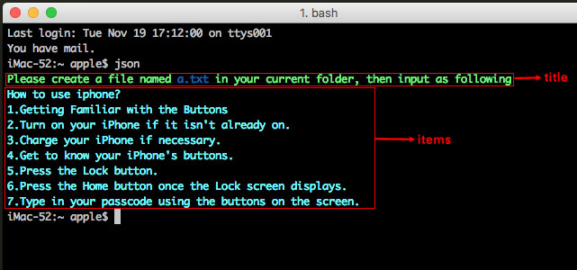

# TextToJson
parse text to json

### useage
```
# install 
go install github.com/scott-x/TextToJson
mv $GOPATH/bin/TextToJson json
json [-e] # -e: exam https://github.com/scott-x/exam
```
If your current folder doesn't have `a.txt`, it will give you a tip:

```
Please create a file named a.txt in your current folder, then input as following
How to use iphone
1.Getting Familiar with the Buttons
2.Turn on your iPhone if it isn't already on. 
3.Charge your iPhone if necessary.
4.Get to know your iPhone's buttons. 
5.Press the Lock button. 
6.Press the Home button once the Lock screen displays.
7.Type in your passcode using the buttons on the screen.
```
As for the content of text, you can reffer to a.txt in this project.

Enjoy yourself.


